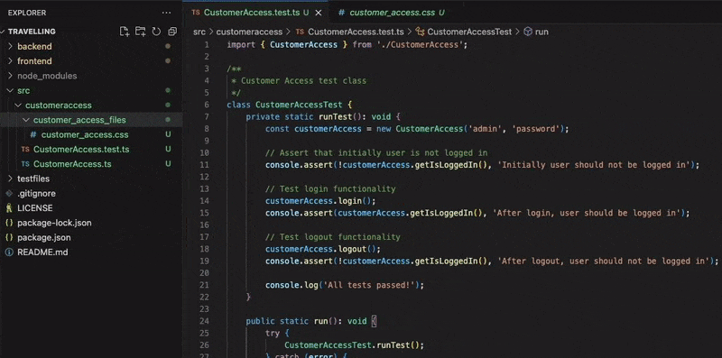

# Smart Rename and Replace

This extension allows you to search and replace all similar texts in selected file or folder, both filename and file content. It is most useful for example renaming a class in a project: when you rename a class, you can also rename all the references to that class in the project.

## Features

- Find and replace selected text in file or folder
- Can replace the searched text in filenames, directory name and/or file content
- Can be run from context menu for any file or folder
- Can be run from command palette for currently opened file
- When running for a folder, you can specify a matching pattern which files to include in search
- When running the replace you can select to automatically replace different writing styles: camelcase, snakecase (upper and lower), kebabcase, pascalcase, uppercase, lowercase.

## Example

Searching for CustomerAccess and replacing it with ClientAccess the extension suggests you with following replacements (from which you can select one or more):

- CustomerAccess -> ClientAccess
- customerAccess -> clientAccess
- customer_access -> client_access
- customer-access -> client-access
- CUSTOMERACCESS -> CLIENTACCESS
- CUSTOMER_ACCESS -> CLIENT_ACCESS
- customeraccess -> clientaccess
- Customer Access -> Client Access
- customer access -> client access

Note: the extension identifies the words by:

1. Capital letters (ie. CustomerAccess)
2. Underscores (ie. customer_access)
3. Dashes (ie. customer-access)

So you can use any of these styles in search and replace and the extension will find them. Also note that the extension does not do any validation on the replacement, so you can also replace CustomerAccess with 1234 or any other string.

## Usage

## Release Notes

### 1.0.0

Initial release of Smart Rename and Replace.
